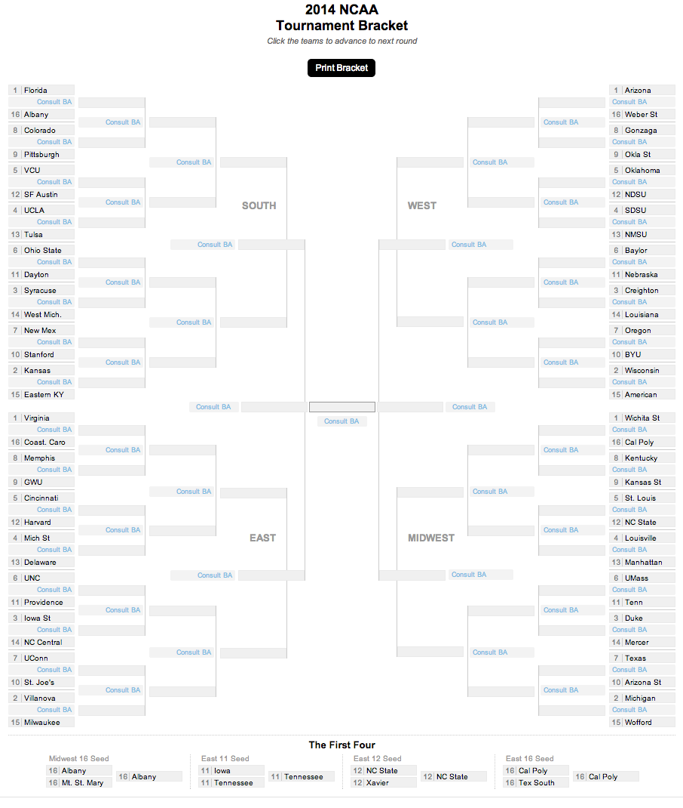

ncaa-bracket
============

What is this?
-------------

Interactive and printable bracket for the annual NCAA March Madness basketball tournament. You can use this to publish the first round matchups, and it lets people pick their winners then print out their brackets. You can also use this to publish the current state of the tournament all the way down to the championship, ala [this 2015 NCAA Tournament men's results bracket](http://www.denverpost.com/colleges/ci_27715608/ncaa-mens-tournament-bracket-2015)

This is not responsive, but please feel free to fork this and make it so. We accept pull requests! Demo: http://www.bracketadvisor.com/interactive-bracket/

Contributors
---------
* [Nelson Hsu](https://github.com/hsunelson)
* [Joe Murphy](https://github.com/freejoe76)

Assumptions
-----------

* Google docs
* jQuery
* Miso

What's in here?
---------------

The project contains the following folders and important files:

* ``index.html`` -- Blank bracket
* ``/js`` -- Javascript
* ``/css`` -- Strangely enough, stylesheets

How to use this
---------------

1. Make a copy of this Google doc: https://docs.google.com/spreadsheets/d/1K4luNfy1yXkD4I-6CKEzvwPKCRAqCu9R6qo0ZMGQBn8/edit?usp=sharing
2. The teams for each region are in separate tabs including the play-in games.  All the labels are in the first tab. Once you have entered all the teams and information, "Publish to the web..."
3. In the Publish window, you'll find a URL that will contain a key. Copy that and paste into line 16 of js/bracket.js
4. You'll probably want to update the year- and tournament-specific information at the top of index.html

License
----------

The MIT License (MIT)

Copyright (c) 2014 Digital First Media

Permission is hereby granted, free of charge, to any person obtaining a copy
of this software and associated documentation files (the "Software"), to deal
in the Software without restriction, including without limitation the rights
to use, copy, modify, merge, publish, distribute, sublicense, and/or sell
copies of the Software, and to permit persons to whom the Software is
furnished to do so, subject to the following conditions:

The above copyright notice and this permission notice shall be included in all
copies or substantial portions of the Software.

THE SOFTWARE IS PROVIDED "AS IS", WITHOUT WARRANTY OF ANY KIND, EXPRESS OR
IMPLIED, INCLUDING BUT NOT LIMITED TO THE WARRANTIES OF MERCHANTABILITY,
FITNESS FOR A PARTICULAR PURPOSE AND NONINFRINGEMENT. IN NO EVENT SHALL THE
AUTHORS OR COPYRIGHT HOLDERS BE LIABLE FOR ANY CLAIM, DAMAGES OR OTHER
LIABILITY, WHETHER IN AN ACTION OF CONTRACT, TORT OR OTHERWISE, ARISING FROM,
OUT OF OR IN CONNECTION WITH THE SOFTWARE OR THE USE OR OTHER DEALINGS IN THE
SOFTWARE.
